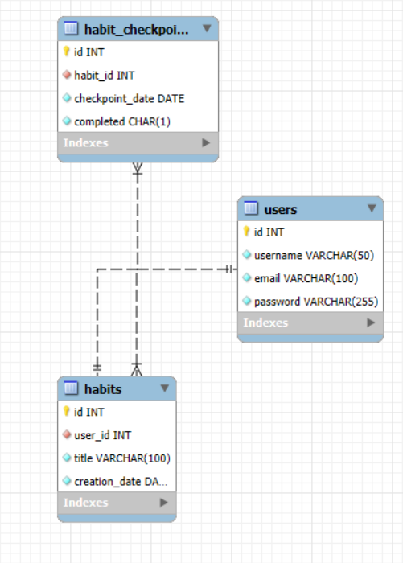
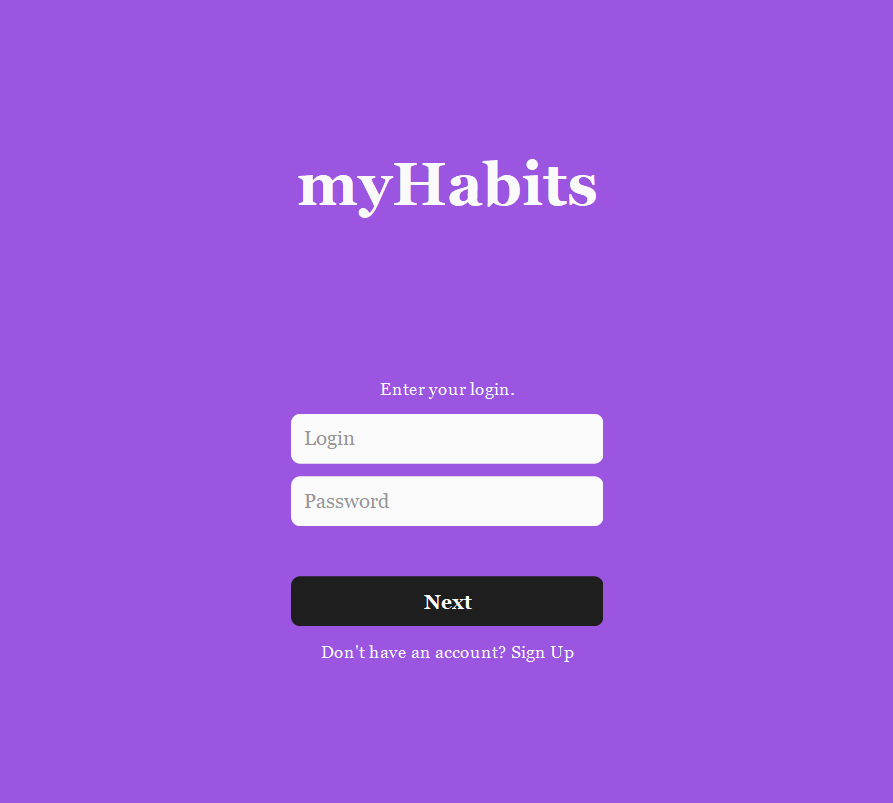
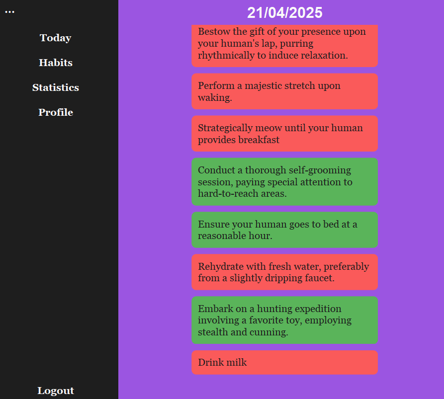
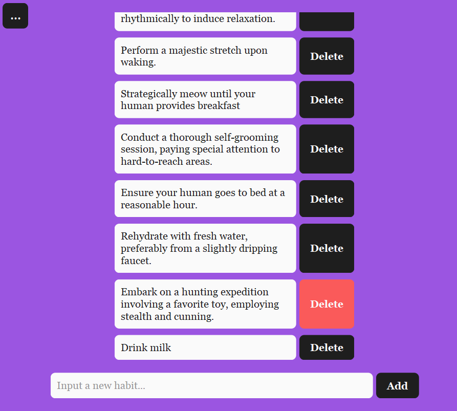

A personal desktop application for habit/goal tracking.
## Technologies Used
**Java** — main development language.  
**Swing** — for the graphical user interface.  
**MySQL** — for data storage.  
**JDBC** — for application-to-database interaction.  
**Maven** - for building the project.  
## Usage
**Launch via the** *Main* **class. Database configuration is done through** *config.properties* **located in the resources. A template is provided as** *config-template*.  
## Architecture
- **Model** - contains POJO classes representing data (*Habit* — a habit/goal (name, creation date), *HabitCheckpoint* — completion marks, *User* — user).    
- **DAO** - implements data access and SQL queries.    
- **Service** - manages the processes of creating, editing, and handling requests to DAO.  
- **Session** - manages the current user session.  
- **Response** - defines response structures (for *User* — authorization).  
- **Utils** - contains *DatabaseConnector* for connecting to MySQL via JDBC, *Configurator* for loading configuration, *ValidationUtils* for validating user data.  
- **View** - graphical interface built with Swing.
## ER-Diagram and Graphical Interface

